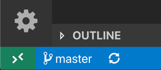
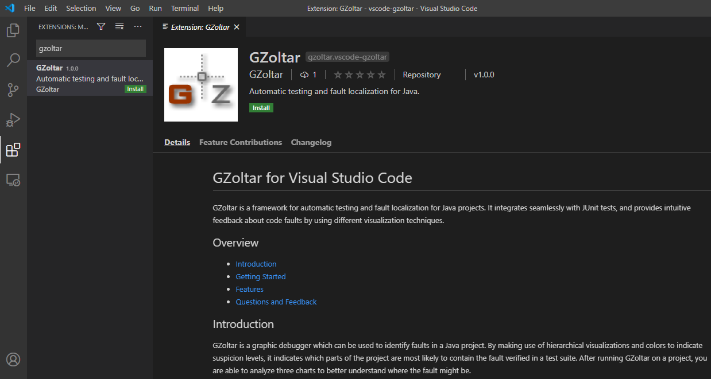
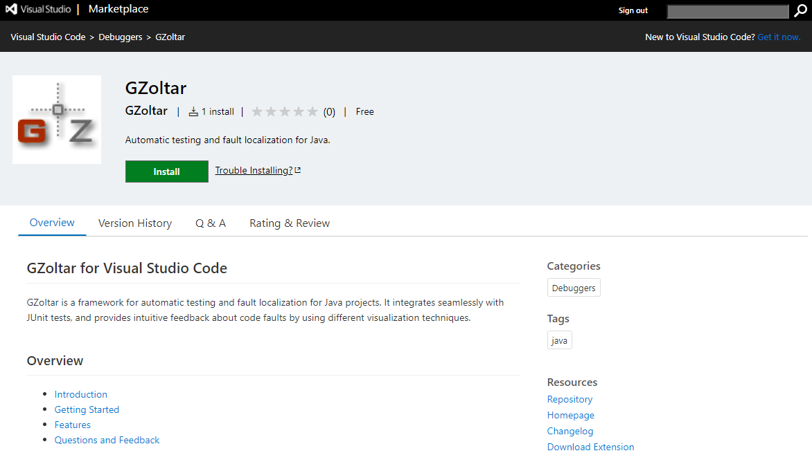
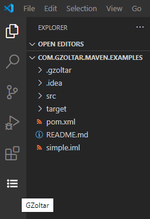
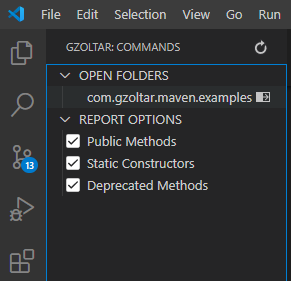
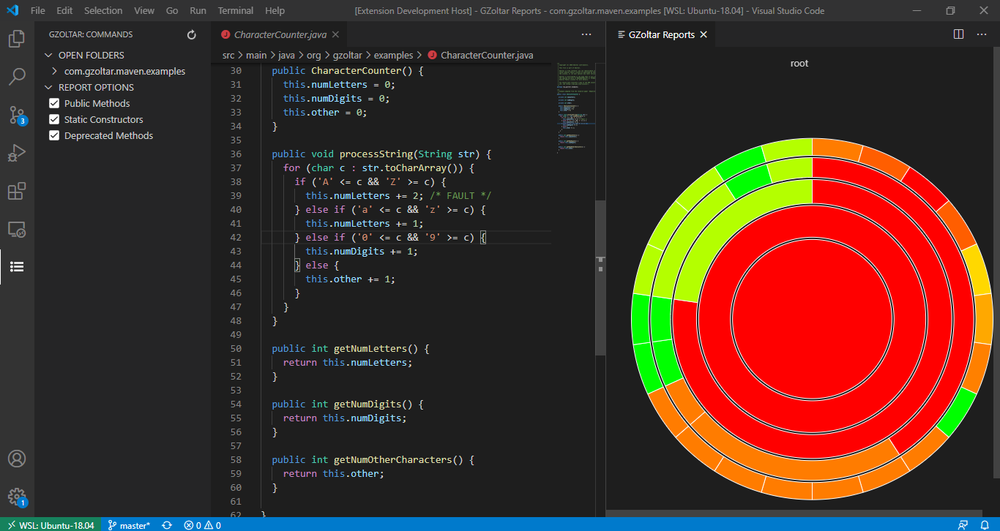
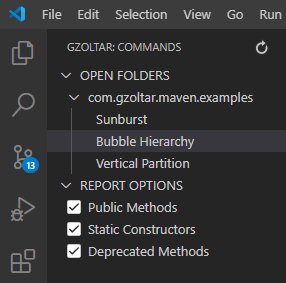
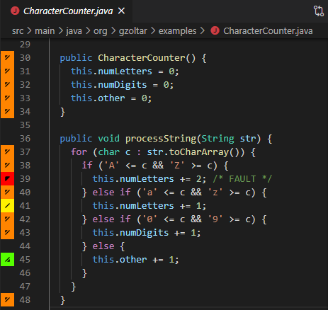

# Visual Studio Code extension

## Requirements

Before using GZoltar's Visual Studio Code extension, a few requirements have to
be met in order to use its capabilities to the fullest:

- **JDK**  GZoltar's Visual Studio Code extension requires Java 8, as GZoltar
  does execute fault localization on Java projects.

- **Build Tool**  GZoltar's Visual Studio Code extension extension is
  automatically activated on projects that use one of the following build tools:
  [Apache Maven](https://maven.apache.org) or [Gradle](https://gradle.org).

- **Environment**  Linux and MacOS users can immediately start using the
  extension if the previous requirements are already met.  Windows users
  however, must take some additional steps.  This is due to an underlying bug in
  GZoltar which causes the execution to produce incorrect results.

  - *Windows users*  First step is to install a Windows subsystem for Linux of
  your choosing.  As long as you are able to use a Linux terminal in your
  computer, you should be good to go.  The next step is to install the extension
  [Remote - WSL](https://marketplace.visualstudio.com/items?itemName=ms-vscode-remote.remote-wsl).
  This extension allows you to use Visual Studio Code to build Linux
  applications that run on the Windows Subsystem for Linux.  After installing
  this extension, open a new window of VS Code and click on the green arrows in
  the bottom left corner to open a remote window.

  

Now, you are able to start working with GZoltar just like you would with a
regular Visual Studio Code window.

## Install GZoltar's Visual Studio Code extension from the marketplace

There are two possible ways to install GZoltar's Visual Studio Code extension
from the marketplace.  The first method can be done from inside Visual Studio
Code itself, on the Extensions icon in the tree view container.  From there, you
can search for GZoltar on the prompt and install it.



Alternatively, the extension can be found and installed from the
[marketplace webpage](https://marketplace.visualstudio.com/items?itemName=GZoltar.vscode-gzoltar).



## Usage

To open GZoltar's menu, click on its icon in the activity bar.



To run GZoltar on a project that is currently in your workspace, click on the
icon next to the project's name.



While GZoltar is running, you are able to see on the lower right corner of the
status bar what phase it is currently on.


After it has finished, a new window will appear showcasing the results of the
fault detection analysis.  The colors in the charts indicate the code's
suspicion levels.  Green means the segment has no suspicion, yellow is for
medium likelihood, orange for high likelihood and red for very high likelihood.
The further you zoom in into the chart, the finer grained it becomes.  Meaning
that at the beginning you are viewing the project in its entirety (at the root
level), and at the deepest level you are viewing a single line of code.



It is possible to navigate through the chart by double clicking on each segment.
A right click will reset the chart back to its initial state.  Clicking on an
edge segment (which corresponds to a single line of code) will open the file
associated with that line of code.

You can also change the visualization that is currently being shown.  On the
activity bar menu, under the project that was just used to perform an analysis,
you can choose one of the three charts to change the visualization to better
suit your taste.



When a file is opened after performing an analysis, it will show an icon to
indicate the level of suspiciousness for each line of code.  The icon's colors
are the same as the ones represented in the charts.



## Build GZoltar's Visual Studio Code extension from the source code

1. Collect the set of required experiments by executing the `get_deps.sh` script.
2. Compile the extension's source code by executing the command `npm run compile`.

## Publish GZoltar's Visual Studio Code extension

1. To package the extension into a [VSIX](https://docs.microsoft.com/en-us/visualstudio/extensibility/anatomy-of-a-vsix-package)
file, execute the following command `vsce package` on the command line.

2. There are two possible ways to publish GZoltar's Visual Studio Code extension.
Assuming you are a member of the GZoltar Publisher, you can obtain a Personal
Access Token (PAT) in [here](https://dev.azure.com).  Then, you should run the
following commands:

```
vsce login GZoltar
Personal Access Token for publisher 'GZoltar': <insert your PAT>
vsce publish
```

Alternatively, you can do both steps in one single command:

```
vsce publish -p <token>
```
